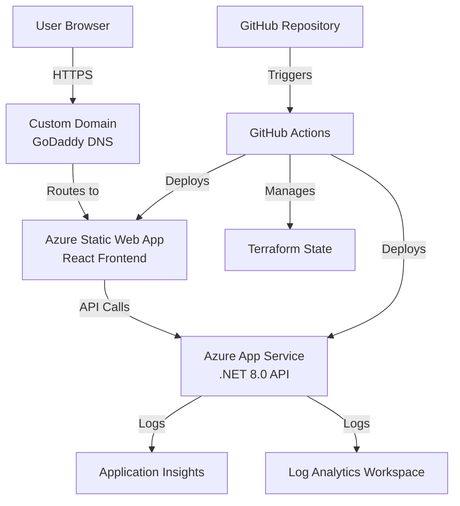

# Azure Deployment Plan for Portfolio Application

This plan covers the complete journey from Azure signup to a fully deployed portfolio website with custom domain, organized into three main phases: Azure Setup, CI/CD Configuration, and Domain Configuration.

## Architecture Overview



## Phase 1: Azure Signup and Configuration

### 1.1 Azure Account Setup

- **Sign up for Azure**: Go to [azure.microsoft.com](https://azure.microsoft.com) and create a free account (includes $200 credit for 30 days)
- **Verify identity**: Complete phone/credit card verification (card won't be charged unless you upgrade)
- **Access Azure Portal**: Navigate to [portal.azure.com](https://portal.azure.com)

### 1.2 Install Required Tools

- **Azure CLI**: Download from [docs.microsoft.com/cli/azure/install-azure-cli](https://docs.microsoft.com/cli/azure/install-azure-cli)
  - Verify installation: `az --version`
- **Terraform**: Download from [terraform.io/downloads](https://www.terraform.io/downloads)
  - Verify installation: `terraform --version`

### 1.3 Azure CLI Authentication

- Login to Azure: `az login`
- Set default subscription (if multiple): `az account set --subscription "Your Subscription Name"`
- Verify current subscription: `az account show`

### 1.4 Create Service Principal for GitHub Actions

- Create service principal with contributor role:
  ```bash
  az ad sp create-for-rbac --name "portfolio-github-actions" --role contributor --scopes /subscriptions/{subscription-id} --sdk-auth
  ```

- **Save the JSON output** - this will be used as GitHub secret `AZURE_CREDENTIALS`

### 1.5 Create Storage Account for Terraform State (Optional but Recommended)

- Create resource group for state: `az group create --name terraform-state-rg --location eastus`
- Create storage account: `az storage account create --name {unique-name} --resource-group terraform-state-rg --location eastus --sku Standard_LRS`
- Create container: `az storage container create --name tfstate --account-name {unique-name}`
- **Note the storage account name** - needed for Terraform backend configuration

## Phase 2: GitHub Actions CI/CD Pipeline Configuration

### 2.1 Repository Setup

- Ensure code is pushed to GitHub repository
- Navigate to repository Settings → Secrets and variables → Actions

### 2.2 Configure GitHub Secrets

Add the following secrets in GitHub repository settings:

- `AZURE_CREDENTIALS`: JSON output from service principal creation (Phase 1.4)
- `AZURE_SUBSCRIPTION_ID`: Your Azure subscription ID (get with `az account show --query id -o tsv`)
- `AZURE_RG`: Resource group name (e.g., "portfolio-rg")
- `TERRAFORM_STATE_STORAGE_ACCOUNT`: Storage account name (if using remote state)
- `TERRAFORM_STATE_CONTAINER`: Container name (e.g., "tfstate")
- `TERRAFORM_STATE_RESOURCE_GROUP`: Resource group for state storage

### 2.3 Create Backend Deployment Workflow

Create `.github/workflows/deploy-backend.yml`:

- **Triggers**: On push to main/master branch, changes in `backend/` directory
- **Steps**:

  1. Checkout code
  2. Setup .NET 8.0 SDK
  3. Restore dependencies
  4. Build and publish backend
  5. Deploy to Azure App Service using Azure Web App Deploy action
  6. Configure App Settings (CORS, Application Insights connection string)

### 2.4 Create Frontend Deployment Workflow

Create `.github/workflows/deploy-frontend.yml`:

- **Triggers**: On push to main/master branch, changes in `frontend/` directory
- **Steps**:

  1. Checkout code
  2. Setup Node.js
  3. Install dependencies
  4. Build frontend (Vite build)
  5. Deploy to Azure Static Web App using Azure Static Web Apps Deploy action
  6. Configure environment variables (VITE_API_URL pointing to backend)

### 2.5 Create Infrastructure Deployment Workflow

Create `.github/workflows/deploy-infrastructure.yml`:

- **Triggers**: Manual workflow dispatch, changes in `infrastructure/` directory
- **Steps**:

  1. Checkout code
  2. Setup Terraform
  3. Configure Azure backend (if using remote state)
  4. Terraform init, plan, and apply
  5. Output backend and frontend URLs
  6. Update GitHub secrets with new URLs (if changed)

### 2.6 Update Terraform Configuration

- Update `infrastructure/main.tf` backend block with storage account details
- Ensure Terraform outputs backend and frontend URLs for use in deployment workflows
- Update CORS configuration in backend App Service to include Static Web App URL

## Phase 3: Domain Configuration (GoDaddy to Azure)

### 3.1 Get Azure Static Web App Hostname

- After infrastructure deployment, get the default hostname from Terraform output or Azure Portal
- Example: `portfolio-web-abc123.azurestaticapps.net`

### 3.2 Configure Custom Domain in Azure

- In Azure Portal, navigate to Static Web App → Custom domains
- Click "Add" and enter your domain name
- Azure will provide DNS verification records
- **Note the TXT verification record** provided by Azure

### 3.3 Configure DNS in GoDaddy

- Log into GoDaddy account
- Navigate to DNS Management for your domain
- Add DNS records:

  1. **TXT Record** (for domain verification):

     - Name: `@` or leave blank
     - Value: Azure-provided verification TXT record
     - TTL: 600 seconds

  1. **CNAME Record** (for www subdomain):

     - Name: `www`
     - Value: `{your-static-web-app-hostname}.azurestaticapps.net`
     - TTL: 600 seconds

  1. **A Record or CNAME** (for root domain):

     - Option A: Use CNAME (if GoDaddy supports root CNAME)
       - Name: `@`
       - Value: `{your-static-web-app-hostname}.azurestaticapps.net`
     - Option B: Use A records (if CNAME not supported for root):
       - Get IP addresses from Azure Static Web App custom domain configuration
       - Add multiple A records pointing to those IPs

### 3.4 Verify Domain in Azure

- Wait for DNS propagation (5-60 minutes)
- Return to Azure Portal → Static Web App → Custom domains
- Click "Verify" on your domain
- Once verified, Azure will provision SSL certificate automatically (may take a few minutes)

### 3.5 Update Backend CORS Configuration

- Update `CORS_ALLOWED_ORIGINS` in Azure App Service App Settings to include:
  - `https://yourdomain.com`
  - `https://www.yourdomain.com`
  - Original Static Web App URL (for fallback)

### 3.6 Update Frontend API URL

- Update `VITE_API_URL` in Static Web App App Settings to point to backend
- If using custom domain for backend, configure that as well

## Implementation Files to Create/Modify

### New Files:

1. `.github/workflows/deploy-backend.yml` - Backend CI/CD pipeline
2. `.github/workflows/deploy-frontend.yml` - Frontend CI/CD pipeline  
3. `.github/workflows/deploy-infrastructure.yml` - Infrastructure deployment pipeline
4. `infrastructure/terraform.tfvars` - Terraform variables (from example file)

### Files to Modify:

1. `infrastructure/main.tf` - Update backend block with storage account details
2. `backend/Portfolio.Api/Program.cs` - Verify CORS configuration handles custom domain
3. `frontend/src/services/api.js` - Already configured correctly to use environment variable

## Key Considerations

### Cost Management

- Azure Static Web Apps Free tier: 100GB bandwidth, 1 custom domain
- App Service B1 (Basic): ~$13/month (can start with Free tier F1 for testing)
- Application Insights: Free tier includes 5GB data ingestion/month
- **Total estimated cost**: ~$15-20/month for production setup

### Security

- All secrets stored in GitHub Secrets (encrypted)
- Terraform state stored in Azure Storage (encrypted at rest)
- HTTPS enforced on all endpoints
- CORS properly configured

### Monitoring

- Application Insights automatically configured
- Health check endpoint at `/api/health` monitored by Azure
- Log Analytics workspace for centralized logging

## Prerequisites Checklist

Before starting, ensure you have:

- [ ] Azure account created and verified
- [ ] GitHub repository with code pushed
- [ ] GoDaddy domain purchased and accessible
- [ ] Azure CLI installed and authenticated
- [ ] Terraform installed
- [ ] Local development environment working

## Next Steps After Plan Approval

1. Execute Phase 1 (Azure setup)
2. Execute Phase 2 (GitHub Actions workflows)
3. Execute Phase 3 (Domain configuration)
4. Test end-to-end deployment
5. Monitor and optimize